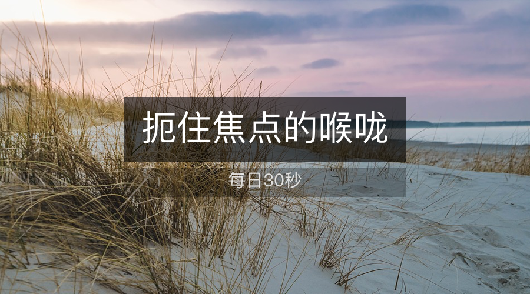
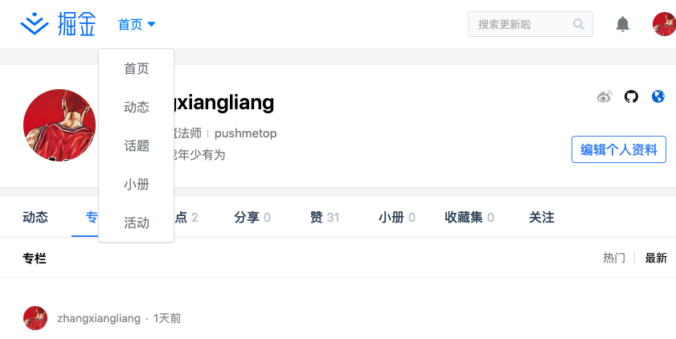
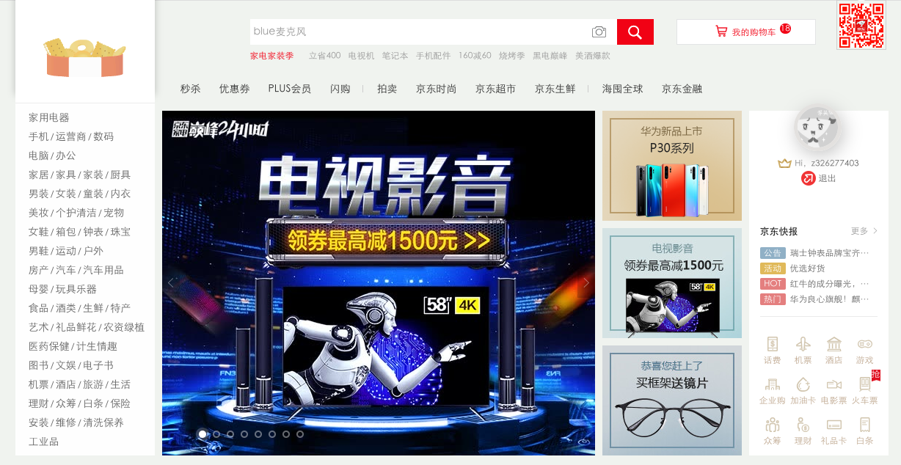

<!-- # 扼住焦点的喉咙 -->



## 简介

> 无障碍、HTML 小细节、焦点、a11y、Accessibility、框架选择

无障碍开发还是应该从 `HTML` 开始聊起，无论是盲人阅读器还是浏览器等工具最核心的部分还是在 `HTML`，毕竟没了 `CSS` 只是不美观了，没了 `JavaScript` 只是少了交互和无限扩展的可能性。

有的同学会说了产品和老板拿着鞭子在后头赶马车`哪里有时间写这些`？现实是这样的，但是在选择UI框架的时候可以选择 无障碍 做得好的来提升网站的友好度，有句话说得好 `居庙堂之高则忧其民，处江湖之远则忧其君`，灵活变通下不影响生活体验岂不是美哉？

## 键盘与交互

`HTML` 标签元素中还有一种比较少人知道的分类方法：`交互标签` 和 `非交互标签`，在无障碍开发中需要留意的便是这二者。`交互标签` 往往会和 `焦点` 一起出现，按下 `tab` 键选择页面上的 `交互标签` 这个时候交互标签会被 蓝色的 `焦点` 框覆盖，如果想反向选择可以使用 `shift + tab`。

在掘金个人主页里按下 `tab` 键后，蓝色的`焦点`框会从 logo 到 首页一个个链接遍历下来，在这个过程中可以发现 `链接`、`按钮`、`搜索框` 都会产生焦点。细心的同学如果打开控制台会还会发现，跳转的顺序和标签在 HTML 中出现的`先后顺序`有关。


运动觉障碍的用户，例如霍金大大就可以利用他的三个指头配合 `tab` 和 `shift + tab` 来浏览 `掘金` 并在掘金上做交互性的操作。除此之外键盘上的 `方向键` 也是移动和浏览页面必不可少的一部分，你可以使用 `上下键` 来是的页面可以上下滚动，也可以在 `select 标签` 中选择选项。

> 更多无障碍群体内容可以阅读 [无障碍世界](https://github.com/zhangxiangliang/30-seconds-for-everyday/blob/master/posts/a11y-101.md)

## 调试工具

正所谓 `工欲善其事必先利其器` 对于被 `焦点` 选中的元素，可以通过 `document.activeElement` 来获取。当然也可以使用插件来完成，这里推荐谷歌浏览器的一款插件 `accessibility developer tools` 。

## 交互标签

通过这个测试可以知道关于`交互标签的情报`便是 `链接`、`按钮`、`搜索框` 是交互标签，下面用选择器来总结一下 `交互标签`：

```javascript
const tags = [
    'a[href]', 'area[href]', 'audio[controls]', 'video[controls]',
    'input:not([disabled])', 'select:not([disabled])',
    'textarea:not([disabled])', 'button:not([disabled])',
    'iframe', 'object', 'embed', '[contenteditable]',
    '[tabindex="0"]',
];

const allTagsDOM = document.querySelectorAll(tags.join(','));

console.log(allTagsDOM);
```

## 非交互标签

除了 `交互标签` 中提到的标签外都属于 `非交互标签`，有些开发老司机可能会问：

* 如果想让 `非交互标签` 变成 `交互标签` 怎么办？
* 使用自定义标签例如 select 或者 button 怎么办？

### 变成交互标签

这里便需要一个很经常被忽略掉的标签 `tabindex`：

```html
<element tabindex="number">
```

它根据 `tabindex` 从小到大来控制 `tab` 的跳动顺序，虽然可以控制整个页面的浏览顺序，但是最好只使用 `0` 来指定 `tabindex` 属性。在上面也提到过打开控制面板查看`页面结构` 会发现 `tab` 默认的`跳转顺序`和 `标签顺序`是一致的，如果破坏掉了这个顺序对于一些不兼容 `tabindex` 的盲人辅助工具、浏览器会造成无法兼容的情况。

#### 破坏标签顺序

从下面例子也能了解到 `页面结构顺序` 非常重要，如果`屏幕阅读器`不支持 `tabindex` 时便会先读取`footer`标签的中内容，对于盲人来说可能会一头雾水不知道网站怎么使用：

##### 代码

```html
<!-- 正常顺序 -->
<!--<header>header</header>-->
<!--<main>main</main>-->
<!--<footer>footer</footer>-->

<!-- tabindex 控制顺序 -->
<footer tabindex='3'>footer</footer>
<main tabindex='2'>main</main>
<header tabindex='1'>header</header>
```
##### 效果


#### 破坏显示顺序

除此之外当使用 css 样式 `float: right` 改变页面渲染的排列顺序也可能会造成影响，对于习惯从右向左阅读的用户来说会造成困惑找不到焦点的位置。

##### 代码

```
<style>
    button { float: right; }
</style>

<button>1</button>
<button>2</button>
<button>3</button>
```

##### 效果


### 自定义元素

当自定义元素时需要把元素默认的 `焦点` 功能模拟出来进行替换即可。在上文提到了 `非互动标签` 转换 `互动标签` 利用 `tabindex` 这个属性来完成，其实还有一个小技巧利用 `tabindex=-1` 设置标签后，对应的 DOM 节点将会拥有 `focus()` 方法，利用这一点可以配合 `JavaScript` 可以实现非常多的功能。

主要需要注意的是 `tab键`、`enter键`、`方向键`、`space键` 的功能。

## 看不见的元素

提到看不见的元素很多同学可能会一头雾水，最常见的看不见标签便是隐藏的`导航菜单栏`：




上面讲到的 `交互标签` 会按顺序被 `tab` 选中成为焦点，导航菜单中的元素是一个个的 `a[href]`，当在使用 `tab` 浏览的时候焦点会被锁定在这个`隐藏的菜单`之中。如果没有把鼠标悬浮在`首页`上时，用户可能会产生困惑 `焦点去哪里了`。

这个时候的解决方法便是使用 `display:none` 或者 `visibility:hidden` 来控制标签不在 `tab` 的选着范围中。两者区别是 `display:none` 会让元素在渲染树中消失，不占用任何空间，`visibility:hidden` 则保留元素占据的空间，也依旧在渲染树中。当需要的时候使用 `display:block` 和 `visibility:visible` 进行显示。

> 掘金的隐藏菜单做得挺好的，不会让焦点跳转到 `隐藏菜单`，美中不足的是只能通过鼠标悬浮来 `显示菜单` ，不能通过 `tab` 和 `enter` 进行选中操作。


## 实例

### 主内容快速切换

通过点击菜单栏来进行页面的切换，但是你有思考过当切换完菜单，用户要浏览内容还得按多少下 `tab` 才能进入内容标签嘛？如果菜单栏有五六十个的情况是多么可怕，你还真别说没有 `某东` 和 `某宝` 的菜单项就有这么多：



不过当选中标签按下 `enter` 时，他们会直接打开新的页面算是减少了用户需要 `tab` 的次数，不过在新页面上还是要重新点击多次 `tab` 才能浏览内容。我们可以利用 `锚点` 和 `tabindex=-1` 来帮助用户快速切换内容焦点：

```html
<a class="super-skip" href="#content">快速进入内容</a>

<nav>
    <a class="menu-items" data-page="home" href="/home">Home</a>
    <a class="menu-items" data-page="post" href="/post">Post</a>
    <a class="menu-items" data-page="user" href="/user">User</a>
</nav>

<main id="content" tabindex="-1">
    主要内容
</main>
```

这下用户按下 `tab` 便可以快速选择是否`直接浏览内容`，但是这个 `a 标签` 会影响到页面的美观，可以利用 `css` 样式中的 `position: absolute` 和 `:focus` 来帮助隐藏 `a 标签` 功能保持不变[codepan](https://codepen.io/zhangxiangliang/pen/wZejXN)

```css
.super-skip {
    position: absolute;
    top -40px;
    left: 0; 
    z-index:100;
}

.super-skip:focus {
    top: 0;
}
```

### 快速切换菜单

在单页面浏览中用户会在 `菜单` 中选择 `菜单项`，但是页面内容改变的却还是要 `tab` 浏览完剩下的标签才能将 `焦点` 切换到 `页面内容`，可以利用 `tabindex=-1` 和 `focus()` 来快速的将`焦点`切换至页面内容 [codepan](https://codepen.io/zhangxiangliang/pen/XQgqqK)：

```html
<style>
    .page {
        display: none;
    }

    .active {
        display: block;
    }
</style>

<nav>
    <a class="menu-items" data-page="home" href="/home">Home</a>
    <a class="menu-items" data-page="post" href="/post">Post</a>
    <a class="menu-items" data-page="user" href="/user">User</a>
</nav>

<div class="home page active">
    <h1 class="title" tabindex="-1">home</h1>
</div>

<div class="post page">
    <h1 class="title" tabindex="-1">post</h1>
</div>

<div class="user page">
    <h1 class="title" tabindex="-1">user</h1>
</div>

<script>
    const doms = document.querySelectorAll('.menu-items');
    const items = Array.from(doms);

    function superSkip(e) {
        const page = e.target.getAttribute('data-page');
        const oldPage = document.querySelector('.active');
        const newPage = document.querySelector(`.${page}`);
        const newPageTitle = document.querySelector(`.${page} .title`);

        // 切换页面
        oldPage.classList.remove('active');
        newPage.classList.add('active');

        // 设置焦点
        newPageTitle.focus();
        e.preventDefault();
    }

    items.forEach(i => i.onclick = superSkip);
</script>
```

### Alert 

在使用弹出自定义 `Alert` 时，由于 `Alert` 的内容也在 dom 元素里，使用 `tab` 进行切换时会导致切换的`焦点` 无法落在 `Alert` 对话框中，这里推荐阅读 `SweetAlert` 的源码它的无障碍做得非常棒，重点阅读 [getFocusableElements](https://github.com/sweetalert2/sweetalert2/blob/dist/dist/sweetalert2.js#L448) 和 [restoreActiveElement](https://github.com/sweetalert2/sweetalert2/blob/dist/dist/sweetalert2.js#L914) 这两个函数。

主要的流程分为：
* 利用 `document.activeElement` 记录当前的`焦点元素`和页面 `x` 和 `y` 坐标。
* 选着当前 `Alert` 对话框中的 `变成交互标签` 上文中提到的 `tags`。
* 设置第一个 `tag` 的属性为 `focus()`。
* 设置最后一个 `tag` 被点击时需要循环重置到第一个 `tag`。
* 如果关闭 `Alert` 则通过一开始记录的`焦点元素`和页面 `x` 和 `y` 坐标进行恢复。

### 自定义元素

在 Element UI 中的自定义元素都做得不错，就是对于视障用户 `焦点focus` 的颜色区分度不够，就连小二自己都看不清已选择的元素时被`focus`在哪里，不过可以通过修改 `is-focus` 来修改样式颜色：

* [Radio](http://element-cn.eleme.io/#/zh-CN/component/radio) 无障碍中 `tab` 和 `space` 都有实现。
* [Checkbox](http://element-cn.eleme.io/#/zh-CN/component/checkbox) 无障碍中 `tab` 和 `space` 都有实现。
* [Select](http://element-cn.eleme.io/#/zh-CN/component/select) 无障碍中 `tab` 和 `enter` 都有实现。
* [TimePicker](http://element-cn.eleme.io/#/zh-CN/component/time-picker)无障碍中 `tab` 和 `enter`、`方向键` 都有实现。

`Material UI` 在无障碍上就做得非常好，而在 `Ant Design` 无障碍相关的 `交互元素` 就做得不怎么好了，如果产品目标群体中有需要 `无障碍` 相关的服务，在选择框架时可以试试其中的 `交互元素` 做得如何，毕竟站在巨人的肩膀上比自己造轮子`快又好`。

## 无障碍相关内容

* [H1 の 小秘密](https://github.com/zhangxiangliang/30-seconds-for-everyday/blob/master/posts/heading.md)
* [img の 小九九](https://github.com/zhangxiangliang/30-seconds-for-everyday/blob/master/posts/img-tag.md)
* [无障碍世界](https://github.com/zhangxiangliang/30-seconds-for-everyday/blob/master/posts/a11y-101.md)
* [扼住焦点的喉咙](https://github.com/zhangxiangliang/30-seconds-for-everyday/blob/master/posts/a11y-foucs.md)
* [语义化与无障碍树](https://github.com/zhangxiangliang/30-seconds-for-everyday/blob/master/posts/a11y-tree.md)
* [HTML Cosplay](https://github.com/zhangxiangliang/30-seconds-for-everyday/blob/master/posts/a11y-aria.md)
* [无障碍工具](https://github.com/zhangxiangliang/30-seconds-for-everyday/blob/master/posts/a11y-tools.md)

## 一起成长

> 在困惑的城市里总少不了并肩同行的 `伙伴` 让我们一起成长。

* 如果您想让更多人看到文章可以点个 `点赞`。
* 如果您想激励小二可以到 [Github](https://github.com/zhangxiangliang/30-seconds-for-everyday) 给个 `小星星`。

> 本文原稿来自 [ZhangXiangLiang](https://github.com/zhangxiangliang)